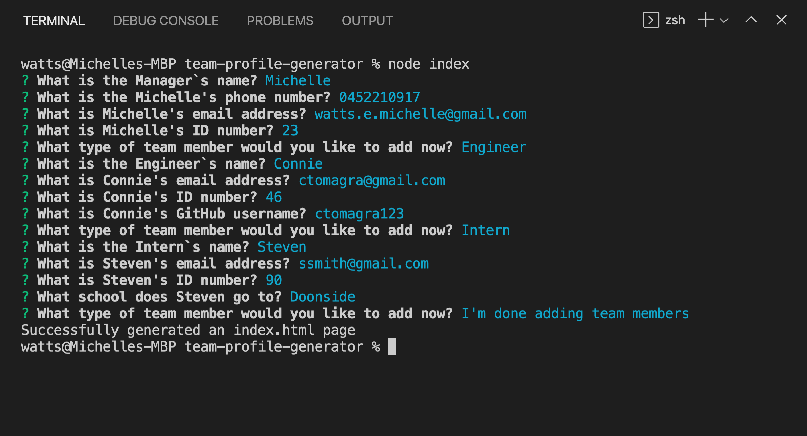

# Team Profile Generator

  

  ## Description
  Generate an index.html page via the terminal that displays the profiles of each member of your team.

  ## Table of Contents
  - [Installation](#installation)
  - [Usage](#usage)
  - [Screenshots](#screenshots)
  - [How to contribute](#contribute)
  - [Tests](#tests)
  - [License](#license)
  - [Questions](#questions)

  ## Installation
  run 'npm i'

  ## Usage
  run 'node index'

  ## Screenshots
  
  
  

  ## Contribute
  They can email me on watts.e.michelle@gmail.com

  ## Tests 
run 'npm test'

  ## License

Permission is hereby granted, free of charge, to any person obtaining a copy of this software and associated documentation files, to deal in the Software without restriction, including without limitation the rights to use, copy, modify, merge, publish, distribute, sublicense, and/or sell copies of the Software.

## Questions
[Github: michellewatts20000](https://github.com/michellewatts20000)
 
[Email: watts.e.michelle@gmail.com](mailto:watts.e.michelle@gmail.com)

## Video
[Watch the video](https://drive.google.com/file/d/1J0Y6uVDRb3E3WnApYX0q7Z-WBztpwEHG/view)
